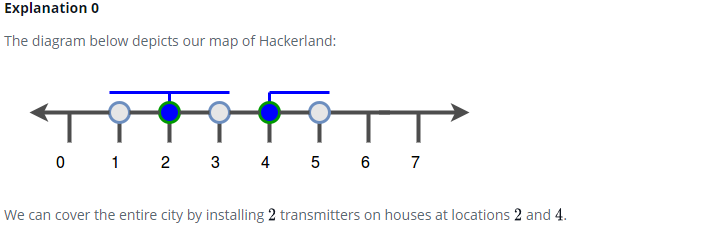

# Hackerland-Radio-Transmitters

Hackerland is a one-dimensional city with houses aligned at integral locations along a road. The Mayor wants to install radio transmitters on the roofs of the city's houses. Each transmitter has a fixed range meaning it can transmit a signal to all houses within that number of units distance away.

Given a map of Hackerland and the transmission range, determine the minimum number of transmitters so that every house is within range of at least one transmitter. Each transmitter must be installed on top of an existing house.


## Example

```
x = [1, 2, 3, 5, 9]
k = 1
```

**3** antennae at houses **2** and **5** and **9** provide complete coverage. There is no house at location **7** to cover both **5** and **9**. Ranges of coverage, are **[1, 2, 3]**, **[5]**, and **[9]**.

## Function Description

Complete the hackerlandRadioTransmitters function.

hackerlandRadioTransmitters has the following parameter(s):

* int x[n]: the locations of houses
* int k: the effective range of a transmitter

## Returns

* int: the minimum number of transmitters to install

## Input Format

* **k** range of the transmitters
* **x** list of houses

## Output Format

Print a single integer denoting the minimum number of transmitters needed to cover all of the houses.

## Sample Input 0

```
k = 1
x = [1, 2, 3, 4, 5]  
```

## Sample Output 0
```
2
```



## Sample Input 1

```
2
7 2 4 6 5 9 12 11
```

## Sample Output 1
```
3
```

## Explanation 1


